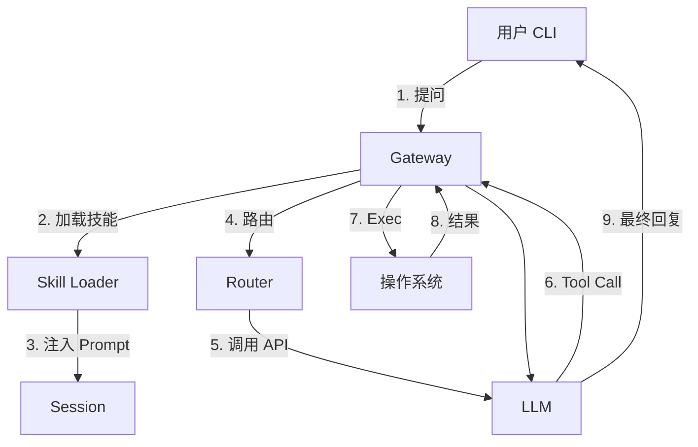

# OpenClaw Learning MVP

这是一个用于学习和构建 Agentic AI 核心架构的最小可行性产品 (MVP)。
通过本项目，我们从零实现了 OpenClaw 的核心组件：Gateway、Agent、Router、Tools 和 Skill Loader。

## 🏗 架构设计

### 核心概念：Hub & Spoke (中心与辐条)
*   **Gateway (The Hub)**: 系统的神经中枢，基于 WebSocket。
*   **Agent (The Brain)**: 负责思考和生成回复的大脑。
*   **Router (The Cerebellum)**: 负责高可用模型调度的小脑。
*   **Tools (The Hands)**: 负责执行操作的双手 (exec)。
*   **Skills (The Knowledge)**: 动态加载的技能库 (Prompt Injection)。

### 数据流向


## 🧩 核心模块

### 1. Gateway (`src/gateway.ts`)
- 启动 WebSocket Server。
- 维护 Session 和 History。
- **ReAct Loop**: 处理 "思考-行动-观察" 的递归循环。
- **Skill Injection**: 启动时注入 `src/skills/` 下的技能。

### 2. Model Router (`src/router.ts`)
- **高可用**: 维护模型池，支持故障切换 (Failover)。
- **速率限制**: 智能处理 429 限速，自动冷却。
- **Tool Support**: 支持传递工具定义和处理 `tool_calls`。

### 3. Skill Loader (`src/skill-loader.ts`)
- 自动扫描 `src/skills/*.md`。
- 将 Markdown 文件转换为 System Prompt，赋予 Agent 新知识。

### 4. Client (`src/client.ts`)
- 命令行聊天工具。

## 🚀 快速开始

### 1. 安装依赖
```bash
npm install
```

### 2. 配置 API Key
编辑 `src/config.ts`，填入你的 LLM API Key。

### 3. 添加技能 (可选)
在 `src/skills/` 目录下创建 Markdown 文件（如 `git.md`），写上教 AI 如何使用 `exec` 完成任务的指令。

### 4. 启动
```bash
# 启动服务端
npm run gateway

# 启动客户端
npm run client
```

## 📚 学习路径
详情请见 [docs/LESSONS.md](./docs/LESSONS.md)。
